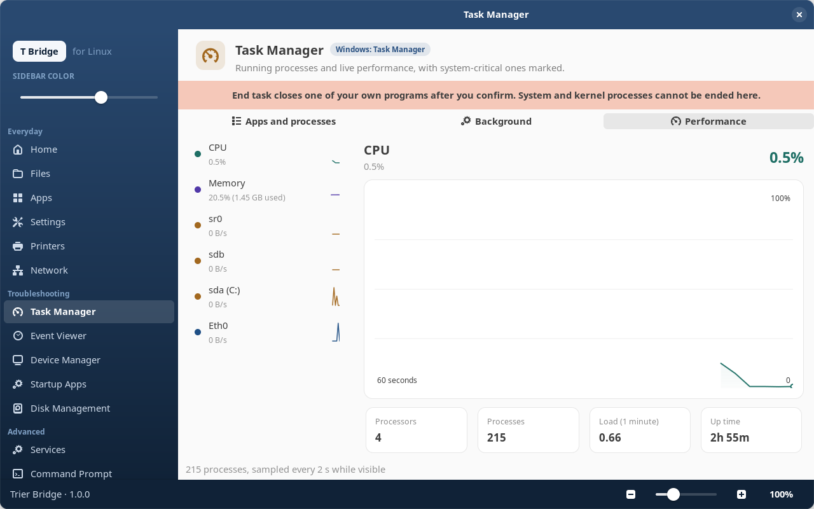
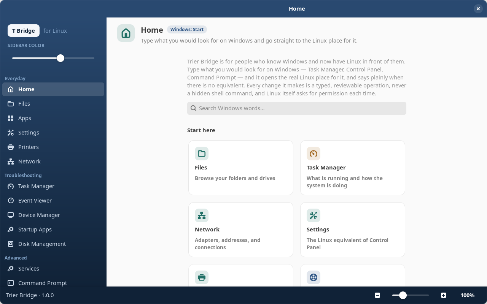
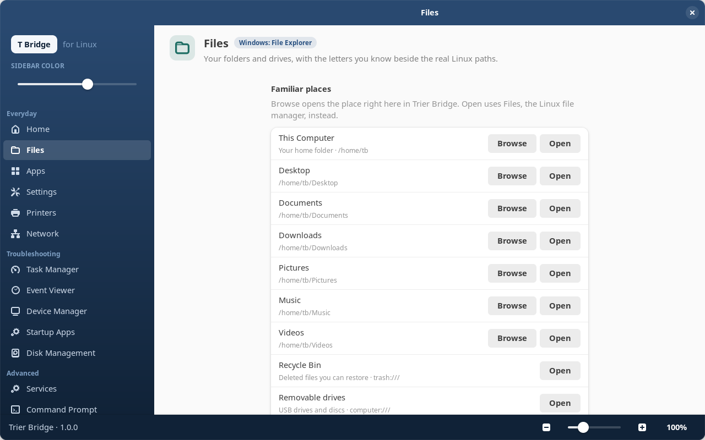
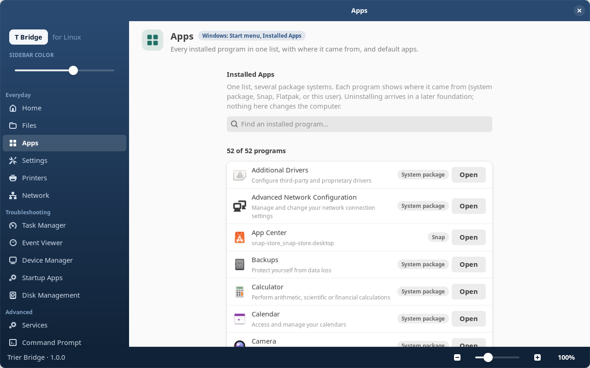
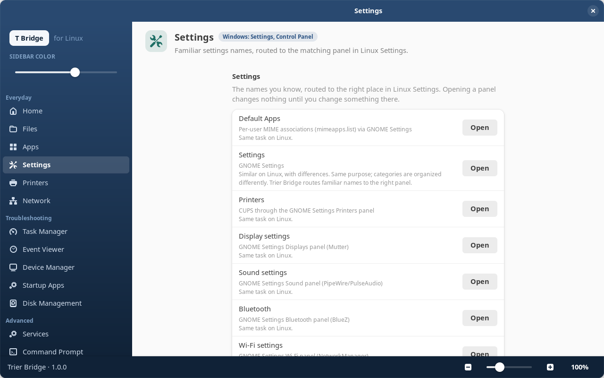
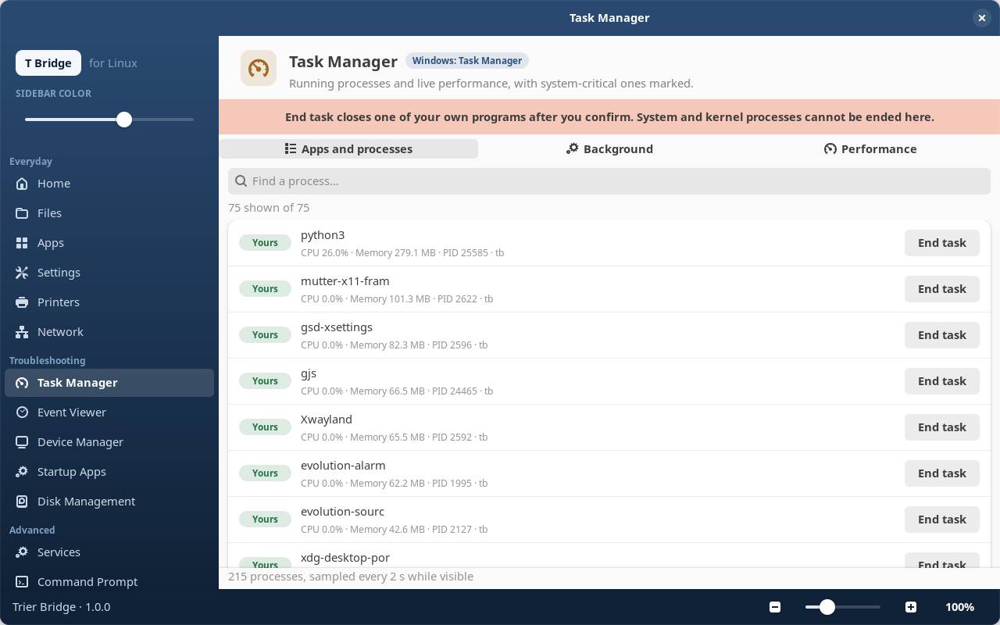
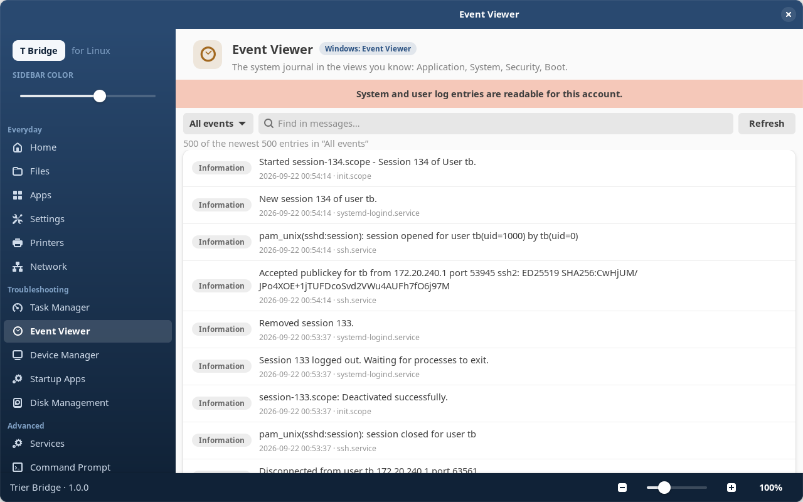
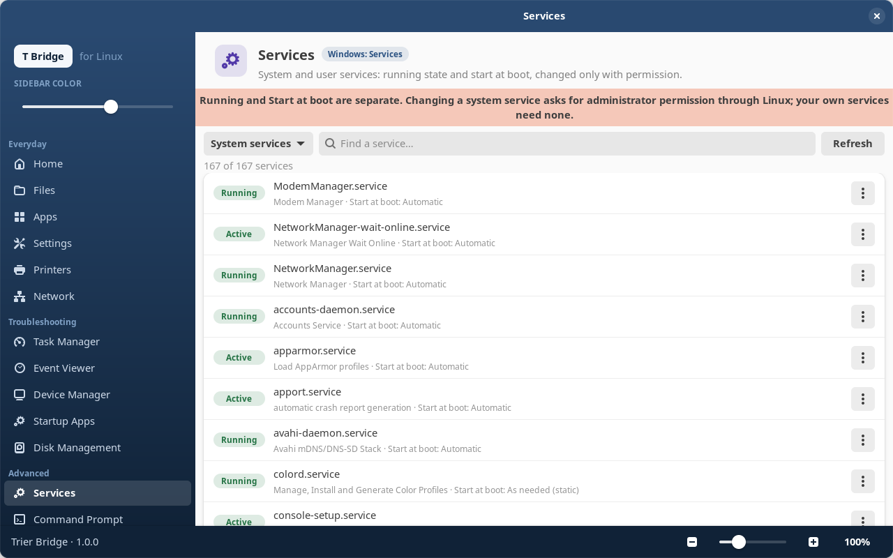
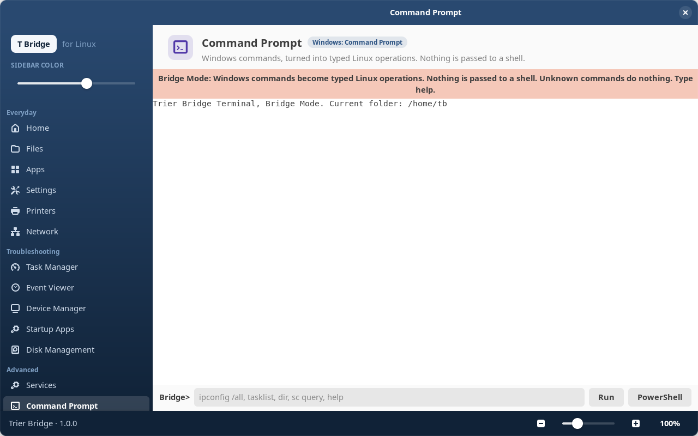
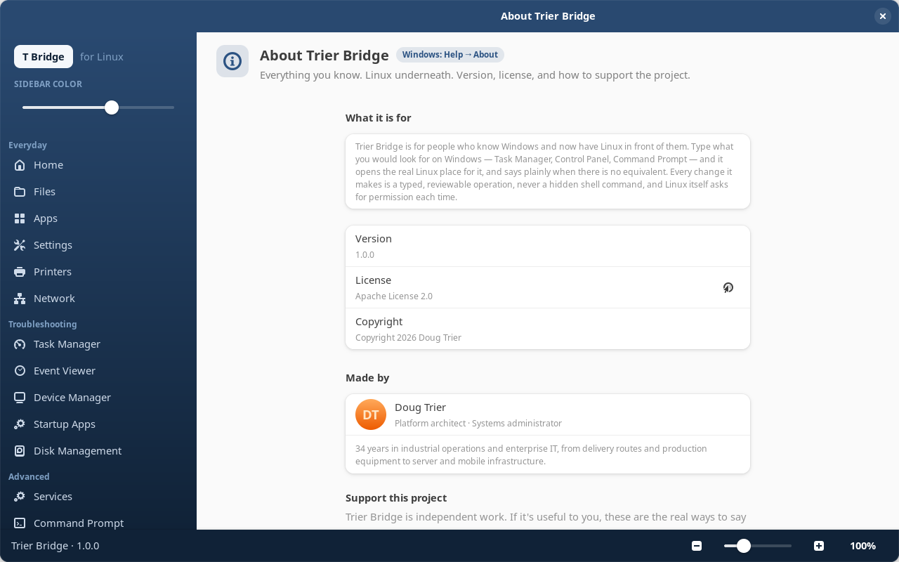

<div align="center">
  

  # Trier Bridge

  **Everything you know. Linux underneath.**

  Trier Bridge is a Windows-to-Linux experience layer for Ubuntu Desktop: the places, names, and tools a Windows user already knows, opened onto the real Linux underneath — without a terminal, and without pretending Linux is Windows.

  [](https://github.com/DougTrier/trier-bridge/releases)
  [](https://ubuntu.com/desktop)
  [](https://gnome.pages.gitlab.gnome.org/libadwaita/)
  [](https://www.python.org/)
  [](./docs/VALIDATION.md)
  [](./LICENSE)

  [Install](#-install) •
  [Screenshots](#-screenshots) •
  [What's inside](#-whats-in-100) •
  [Bridge Terminal](#%EF%B8%8F-bridge-terminal) •
  [How it is built](#%EF%B8%8F-how-it-is-built) •
  [Security](#-security) •
  [Docs](./docs/README.md) •
  [Support](#%EF%B8%8F-support-the-project)

  ---

  *If Trier Bridge makes your move to Linux easier, a star on the repository helps others find it.*
</div>

---

## 🚀 Install

One Debian package for Ubuntu 24.04 Desktop: **`trier-bridge_1.0.0_all.deb`** (about 140 KB). It depends only on what Ubuntu Desktop already ships — Python 3, GTK 4, libadwaita — and pulls in nothing else. Get it from the [Releases](https://github.com/DougTrier/trier-bridge/releases) page.

**Without a terminal.** Right-click the `.deb` in Files → *Open With* → **App Center**, tick *Always use for this file type*, then press **Install**. From then on a double-click installs. (On a stock Ubuntu 24.04 the archive viewer is the default for `.deb` files, so the first time needs that one choice. Once Trier Bridge is installed, *Apps → Default apps → Software installers (.deb)* offers the same choice inside the app.)

**With a terminal**, if you prefer:

```bash
sudo apt install ./trier-bridge_1.0.0_all.deb
```

Everything Trier Bridge writes stays in your home folder (`~/.config/trier-bridge`, `~/.local/state/trier-bridge`); removing the package leaves those behind, the way a Windows uninstall leaves AppData. It never installs or removes other software, never runs as root, and asks Linux for permission — through the normal password prompt — each time a change needs it.

---

## 📸 Screenshots

<div align="center">



*Task Manager → Performance — live graphs for CPU, memory, every disk and every adapter, laid out the way Windows lays them out*

| Home | Files |
|---|---|
|  |  |

| Apps | Settings |
|---|---|
|  |  |

| Task Manager — processes | Event Viewer |
|---|---|
|  |  |

| Services | Command Prompt |
|---|---|
|  |  |



</div>

> Every image above is rendered from the installed 1.0.0 package on an Ubuntu 24.04 desktop, at 1280×800. Full set: [`docs/screenshots/`](./docs/screenshots/).

---

## ✨ What's in 1.0.0

**Everyday**

- **Home** — type what you would look for on Windows (*Task Manager*, *Add or Remove Programs*, *Control Panel*, *Downloads*) and go straight to the Linux place for it.
- **Files** — your folders and drives in an in-app browser, with the drive letters you know (`C:`, `D:`) shown as labels next to the real Linux paths.
- **Apps** — every installed program in one list, with where each one came from, plus a Default apps chooser.
- **Settings** — the familiar names, routed to the matching panel in Linux Settings.
- **Printers** and **Network** — printers and scanners; adapters, addresses, and connection changes translated to NetworkManager.

**Troubleshooting**

- **Task Manager** — End task for your own programs, and a Performance tab with live graphs for CPU, memory, every disk, and every adapter. System-critical processes are marked and protected.
- **Event Viewer**, **Device Manager**, **Startup Apps**, **Disk Management** — the tools by the names you know, over the real Linux sources (the journal, sysfs/udev, autostart entries, udisks).

**Advanced**

- **Services** — running state and start-at-boot, changed only after Linux's own permission prompt.
- **Command Prompt** — Windows commands and PowerShell names, each turned into a typed operation; nothing you type is ever passed to a shell.
- **System Information** — this computer's hardware and software, and what Trier Bridge can and cannot do here.

**Integrations you choose at setup, each reversible** — a tray icon, desktop search that understands Windows words, familiar launchers in the app grid, a Files context-menu entry, Ctrl+Shift+Esc.

**The shell** — a branded sidebar with an adjustable accent color, a zoom control, and a keyboard-navigable layout that follows the desktop theme.

---

## ⌨️ Bridge Terminal

A Windows user types what they know:

```text
C:\Users\You> ipconfig
```

Nothing is substituted into Bash. Every line goes through a strict parser into a typed Trier Bridge operation, which is validated against the machine's real capabilities and the security rules, carried out by a Linux-native adapter with a fixed argument list, verified, and reported back in familiar form:

```text
Windows-style input
        ↓
strict parser
        ↓
typed Trier Bridge operation
        ↓
capability + security validation
        ↓
Linux-native adapter
        ↓
verified result
        ↓
familiar output
```

If no safe, faithful Linux equivalent exists, Trier Bridge says so and performs no hidden substitution.

---

## 🛡️ How it is built

- **Typed operations, never shell text.** A command becomes a parsed, typed operation with a fixed argument list. Not one line of Trier Bridge hands text to a shell, and the project's own gate refuses any change that tries.
- **Linux stays in charge.** Nothing runs as root. Any change that needs permission — a service, a network setting, ending a system process — goes through Linux's own prompt, every time.
- **Honest about what it knows.** A value it cannot read shows as *Unknown*, never as zero. An action interrupted mid-way is shown to you afterward, never silently repeated. Where Windows and Linux differ, it says so instead of inventing a match.
- **Verified on the real thing.** Every change is gated on a real Ubuntu 24.04 desktop: unit and integration tests run against real files, real processes, real services — no mocks anywhere. The package is reproducible and lintian-clean. The **258 invariants** in [`docs/INVARIANTS.md`](./docs/INVARIANTS.md) each trace to evidence tied to a commit hash in [`docs/VALIDATION.md`](./docs/VALIDATION.md), and the code-quality score in [`CODE-QUALITY-REPORT.md`](./CODE-QUALITY-REPORT.md) is measured, not asserted.

Guiding order, always: **everyday continuity → familiar troubleshooting → advanced Windows continuity → optional Linux learning.** Learning Linux is optional. Productivity is not.

---

## 🔐 Security

- No privileged helper, no cached authority: system-scope changes go through polkit and Linux asks each time.
- Explicit trust boundaries; untrusted input (typed commands, IPC, files) is validated on the trusted side; malformed input performs no operation.
- Fixed executable argument arrays everywhere — no shell interpolation, no dynamic command construction.
- Secrets never enter UI state; records are kept without them.
- Full design: [`docs/SECURITY.md`](./docs/SECURITY.md). Please report security issues privately rather than in public issues.

---

## 🧭 What's next

- Builds for Linux Mint and Zorin.
- A package repository, so updates arrive the normal Ubuntu way.
- More of the Windows vocabulary in Home search.

---

## 📖 Documentation

Start with [`docs/README.md`](./docs/README.md), then:

- [`docs/PRODUCT-CONCEPT.md`](./docs/PRODUCT-CONCEPT.md) · [`docs/PRODUCT-NORTH-STAR.md`](./docs/PRODUCT-NORTH-STAR.md) · [`docs/EXPERIENCE.md`](./docs/EXPERIENCE.md)
- [`docs/ENGINEERING.md`](./docs/ENGINEERING.md) · [`docs/SECURITY.md`](./docs/SECURITY.md) · [`docs/INVARIANTS.md`](./docs/INVARIANTS.md) · [`docs/DECISIONS.md`](./docs/DECISIONS.md)
- [`docs/PLATFORMS.md`](./docs/PLATFORMS.md) · [`docs/PACKAGING.md`](./docs/PACKAGING.md) · [`docs/VALIDATION.md`](./docs/VALIDATION.md) · [`docs/CODE-QUALITY.md`](./docs/CODE-QUALITY.md)

Repository-root control documents: [`CONTRIBUTING.md`](./CONTRIBUTING.md) · [`AGENTS.md`](./AGENTS.md) · [`CONTEXT.md`](./CONTEXT.md) · [`Engine Spec Tasklist 01.MD`](./Engine%20Spec%20Tasklist%2001.MD) · [`CODE-QUALITY-REPORT.md`](./CODE-QUALITY-REPORT.md) · [`LICENSE`](./LICENSE) · [`NOTICE`](./NOTICE)

---

## ❤️ Support the project

Trier Bridge is free and open source. If it makes your move to Linux easier, you can support its continued development through the **Sponsor** button at the top of the repository, or directly:

- [GitHub Sponsors](https://github.com/sponsors/dougtrier)
- [Buy Me a Coffee](https://www.buymeacoffee.com/dougtrier)

---

## 📜 License

Apache License 2.0 — see [`LICENSE`](./LICENSE) and [`NOTICE`](./NOTICE). Copyright 2026 Doug Trier.
